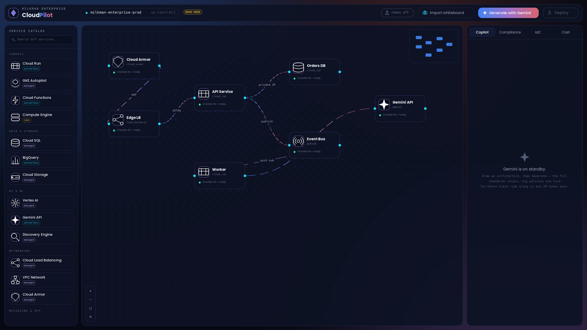

# CloudPilot ✦

**Visual-to-Cloud mission control, powered by Gemini.** Draw your architecture on a canvas, and Gemini — grounded in your entire enterprise standards corpus — synthesizes compliant Terraform, deploys it through Cloud Build, and diagnoses failures with a ready-to-apply patch.

> Demo-branded **MilkMan Enterprise**; every org-specific value is config. Point it at *any* GCP project — the brand, project id, region, standards datastore and build trigger all live in `.env`.



## Why this is a Gemini showcase

CloudPilot leans on three capabilities where Gemini stands alone:

**The 2M-token context window.** Compliance tooling normally retrieves standards in chunks (RAG) and prays the relevant rule made it into the prompt. CloudPilot ships the *entire* standards corpus, the org policy snapshot, the live Terraform state of the whole estate, **and** historical incident postmortems in a single pass — ~1.2M tokens — so every design decision is grounded in everything at once. The token gauge in the Copilot panel shows it happening.

**Native multimodality.** "Import whiteboard" sends a photo of a hand-drawn diagram straight to Gemini — no OCR pipeline, no vision pre-processing service. It returns a structured graph with canvas positions, inferred edge semantics, and a confidence score.

**Grounded generation + function calling.** Discovery Engine grounds output in the customer's own datastore; Cloud Build is triggered as a tool. When a deploy step fails, Gemini correlates the build log against the audit trail *already in context* and emits a diff-ready patch.

## Architecture

```
cloudpilot/
├── backend/                  # 🧠 The Brain — FastAPI gateway (self-host / Vertex path)
│   └── app/
│       ├── main.py           # app factory + lifespan
│       ├── core/config.py    # bring-your-own-GCP settings
│       ├── api/routes.py     # /health /catalog /architect /deployments /diagnose /vision
│       ├── models/schemas.py # strict pydantic wire contracts
│       └── services/
│           ├── vertex_service.py     # Gemini via Vertex AI (live) ✚ demo fallback
│           ├── discovery_service.py  # standards grounding (Discovery Engine)
│           ├── build_service.py      # Cloud Build bridge
│           └── demo_engine.py        # deterministic simulation of the full contract
├── frontend/                 # 🖥 The Interface — React + React Flow + Tailwind
│   └── src/
│       ├── App.jsx           # access gate (Clerk) → Workspace
│       ├── Workspace.jsx     # mission control + capability resolution
│       ├── services/         # demoEngine.js (client-side) + capability-aware api.js
│       └── components/       # Canvas, Flight Deck, Copilot, Diagnosis, KeyModal, …
├── functions/                # ☁️ Cloudflare Pages Functions (edge)
│   ├── _shared/              # clerk JWT verify · gemini call · standards corpus
│   └── api/v1/architect/generate.js   # real-mode Gemini proxy (BYOK + operator)
├── infrastructure/           # ⚙ The Automation
│   ├── pipelines/cloudbuild.yaml     # PREFLIGHT → IGNITION → ASCENT → ORBIT
│   └── standards/*.json              # enterprise standards corpus (datastore seed)
├── tests/                    # 🎭 Playwright e2e — backend 100% mocked
└── showcase/                 # 🎁 zero-install single-file demo (double-click it)
```

## Deploy (Cloudflare Pages free plan)

Connect the repo to Cloudflare Pages and it **just works** — it boots as a fully
interactive demo with no backend, no keys, no login. Auth and live Gemini layer
on top when you're ready. Two independent layers:

- **Access** — [Clerk](https://clerk.com) gates `/project`; leave it unconfigured and the app runs ungated in demo mode. Your portfolio stays public.
- **Capability** — `demo` (local, zero creds) · `byok` (visitor pastes their own Gemini key, session-only) · `operator` (you/invited friends get a role-gated server-side shared key that never touches the browser).

Full step-by-step (build settings, Clerk JWT template, Cloudflare secrets) is in **[DEPLOY.md](DEPLOY.md)** and **[docs/CLERK_SETUP.md](docs/CLERK_SETUP.md)**. Production URL: `https://hunterthemilkman.com/projects/cloudpilot`.

## Run it locally

**Instant demo (zero install):** double-click `showcase/cloudpilot-showcase.html`. Full UI, no build, no backend. Deep-link states with `?state=canvas|reasoning|compliance|iac|orbit|diagnosis`.

**Frontend (demo mode, no creds):**

```bash
cd frontend
npm install
npm run dev          # http://localhost:5173
```

**Optional FastAPI backend (self-host / Vertex):**

```bash
cd backend
python -m venv .venv && source .venv/bin/activate   # .venv\Scripts\activate on Windows
pip install -r requirements.txt
uvicorn app.main:app --reload --port 8000
```

Copy `backend/.env.example` → `backend/.env`, set `GCP_PROJECT_ID`, `DEMO_MODE=false`, and point `GOOGLE_APPLICATION_CREDENTIALS` at a service account to drive real Vertex AI / Discovery Engine / Cloud Build.

## Tests — fully mocked Playwright e2e

The entire backend contract is mocked at the network layer (`tests/mocks.ts` + `tests/fixtures.ts`), so the suite runs anywhere with zero GCP access and zero flakes:

```bash
npm install            # repo root — installs @playwright/test
npx playwright install chromium
npm run test:e2e       # 24 specs: shell, canvas dnd, generation, flight deck, diagnosis, vision
npm run screenshots    # regenerates portfolio shots into screenshots/ (1920×1080 @2x)
```

> The PNGs in `screenshots/` are pixel-faithful design renders generated programmatically (`screenshots/_render_frames.py`) in an offline environment. Run `npm run screenshots` once locally to replace them with true browser captures of the live app — same frames, same states.

## The flight model

| Phase | Steps |
|---|---|
| **PREFLIGHT** | policy gate (org constraints replay) · terraform plan + drift check |
| **IGNITION** | Cloud Build container bake · CVE sweep |
| **ASCENT** | terraform apply · smoke probes (golden signals) |
| **ORBIT** | traffic shift → telemetry nominal 🛰 |

A failed step lights up **Diagnose with Gemini**: root cause with confidence, the evidencing log lines, a unified diff against the generated IaC, and the standards that justify the fix.

---

*Built from the CGI CloudPilot scaffold & blueprint. Generic by design — bring your own GCP.*
